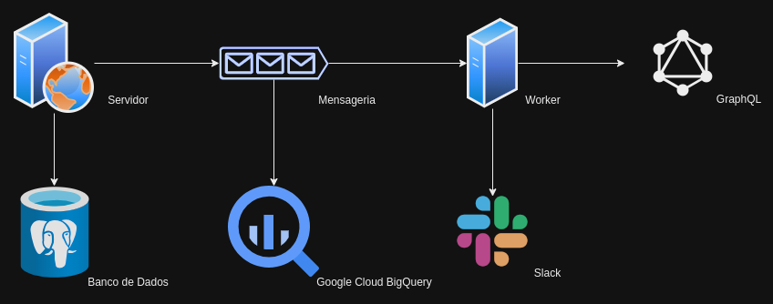
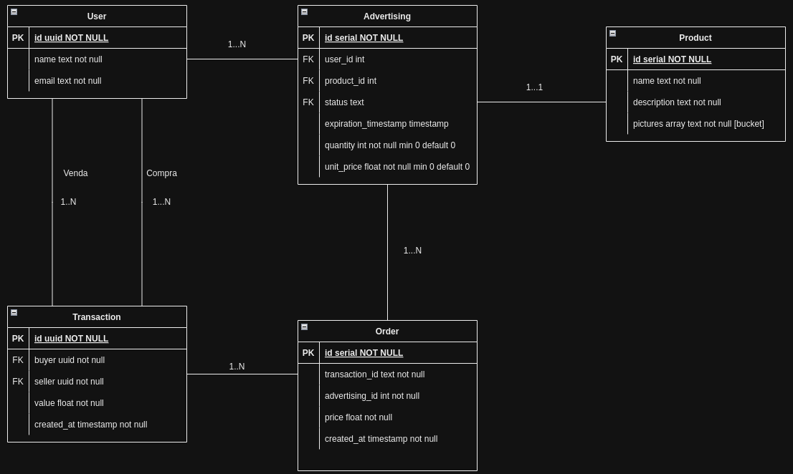

# My-Commerce

## Description

My-Commerce is a system that supports basic e-commerce operations, such as managing users, products, listings, and transactions. The system uses PostgreSQL as the database, integrates with Google Cloud Platform (GCP) for image storage, and is configured for automatic deployment via Cloud Run and GitHub Actions CI/CD.
This project can also be used as a boilerplate.

## Instructions to Build and Run the Project
### How to Use

The first step is to make a copy of the `.env_sample` file and rename it to `.env`. After that, you can run the project either with or without Docker.

#### Docker
If Docker is not installed, follow the installation steps here: [link docker](https://www.docker.com/products/docker-desktop), [link docker compose](https://docs.docker.com/compose/install/);

To run the project, simply enter the command below in the terminal:
```bash
docker compose up --build
```

To make it easier, the above commands have been added to a Makefile. So, if make is installed on your machine, just run:

```bash
make develop-docker
```

This will bring up both a Postgres instance and the API. To test whether the API is working, access the health-check route, which does not require authentication:

```bash
curl --location 'localhost:5000/api/my-commerce/health-check'
```
Or access the documentation via Swagger at `localhost:5000/api/my-commerce/docs`

#### Without Docker
If you want to run the application in a local development environment for testing purposes, first ensure your Python version is 3.10.12 or higher for compatibility. If so, run the following commands in the terminal:
```bash
python3 -m venv venv 
source venv/bin/activate 
pip install -r requirements.txt
uvicorn --app-dir=./src server:api --reload --port 5000
```

Or run it using `make`
```bash
make setup-local-dev-environment
make develop
```

### Tests and Lint
Just run the following make commands, or check the full commands inside the Makefile:
```bash
make test
make lint
make format
```

## Technical and Architectural Decisions
### System Architecture
    


- There is a server hosting the My-Commerce API. This API performs CRUD operations on a Postgres database.
- A relational database was chosen to ensure consistency and ACID properties, which are essential for transactions and purchases.
- When performing any write operation on an entity, a message can be sent to a messaging system such as Kafka or Google Cloud Pub/Sub. If Pub/Sub is used, it can be connected to a BigQuery table for analytics.
- For fraud and risk analysis, a worker connected to the Pub/Sub queue was considered to populate a graph database. Graph databases are commonly used for this purpose due to their ability to efficiently detect relationships between entities (i.e., paths in a graph). This service can have one process to ingest data and another to assess risk in recent transactions, alerting a channel like Slack in case of potential fraud.


### Database Structure
The Entity-Relationship Model (ERM) includes the following entities: User (Customer, Seller), Advertising, Product, Order (like a service order), and Transaction.

#### Entities:
- User: A user of the system, either a buyer or seller;
- Advertising: A listing created by a user. A user can have multiple listings, but a listing belongs to only one user;
- Product: The product that is being advertised in the listing;
- Order: In e-commerce, a customer can usually perform a single transaction to purchase multiple products, and a product can also be paid with multiple transactions (e.g., cashback + credit);
- Transaction: The transaction made between two users.

#### ASome rules when modeling the ERM:
- A transaction is either a purchase or a sale;
- A listing is for one specific product, but it can have N units of it;
- Listings have expiration dates;
- A listing can have zero or more products. When it reaches zero, it is deactivated;
- When the expiration date of a listing is reached, it is deactivated.



#### Notes: 
- The Order entity was created because the relationship between Transaction and Advertising was many-to-many.
- In MeLi, a customer can make a single payment to buy products from different sellers' listings. But for simplicity, here we assume that the customer purchases one product at a time;
- In the ERM, Product appears as a weak entity of Advertising, but it was given its own key. Since the model is in an early stage, this was deemed a premature optimization. This structure could evolve into use cases like listing deduplication (where similar listings/products exist).  

### API Achitecture

The API architecture can be understood by examining the folder structure below. In short, all classes that handle HTTP layer interactions are found in the `controller` folder. These call the `domain` layer, which contains business logic and interacts with databases and external services via the `repository` layer.

In the `data` folder, in addition to repositories, you’ll find database connection classes and a database dump.

In `error_handle` and `exceptions`, you’ll find the logic for application error handling.

In `models`, you’ll find DTOs and object serialization/definition classes. These are also helpful for documentation.

Some functions are executed as `middlewares`, i.e., code that runs before the requests (e.g., CORS and authentication validations).

Utilities and shared logic are placed inside utils.

Finally, a factory design pattern was used for the FastAPI app object. Each method with a "setup_" prefix modifies the app by adding new features. This makes it easy to plug/unplug features. These methods can also be reused across different APIs. This structure is visible in the `create_api` method inside `build.py`. For example, to remove middleware, just delete the line `setup_middlewares(app)`.

```
src
├── controllers
├── data
│   ├── dump.sql
│   ├── gevent_pgsql.py
│   ├── __init__.py
│   └── repositories
├── domain
├── error_handler
├── exceptions
├── middlewares
├── models
├── utils
├── server.py
├── lifespan.py
├── build.py
└── config.py
```

### Justification for Frameworks and Libraries

- FastAPI: Among Python web frameworks, it’s one of the fastest, allowing for asynchronous request processing. It has native OpenAPI integration, facilitates documentation, provides strong typing, is widely adopted, and well-documented. Flask with SQLAlchemy was also considered, but FastAPI was found more practical.

- Pytest, pytest-cov, pytest-mock, pytest-env, pytest-docker: Used for unit and functional testing. These libraries offer simple and efficient tools for test coverage, bug detection, and mocking. With pytest-mock, it’s possible to inspect how many times a function was called, along with its input/output. With pytest-docker, services and databases can be spun up at test time.

- ruff: Preferred linter. Helps maintain code standards and identify unused variables/imports, improving readability and maintainability.

- google-cloud-storage: GCP client library for managing files in cloud storage buckets.

- psycopg2: PostgreSQL connection driver.

## Cloud

The project is deployed on GCP. A container registry was created to upload Docker images. These images are deployed to Cloud Run, a serverless solution. Cloud Run falls somewhere between a virtual machine and an AWS Lambda on the “serverless scale.” It is similar to AWS Fargate or AppRunner.
Cloud Run launches one or more containers from the registry and also accesses Cloud SQL, Google’s managed PostgreSQL-as-a-service.

## Future Work
### Business Rules:
- In the Advertising update endpoint, add a rule: if quantity becomes zero, update status to inactive;
- When creating an Order, update Advertising with the rule above (update quantity and status).

### Architecture:
- Create a queue on Google Cloud Pub/Sub;
- Publish all write operations of transactions to Pub/Sub;
- Create a worker to analyze fraud, send alerts, and populate GraphQL;
- Add monitoring (e.g., RPM, average request time, 80/90/95 percentile latency, daily error rates, and unmapped 500 errors) — this can be done with Datadog.

### Code:
- Improve test coverage;
- Add more functional tests;
- Add new features for file handling — possibly make it an entity with its own controller and domain.

## Observações
- Inside the `postman` folder, you’ll find collections and environment files to import into Postman;
- The `lambda_functions` folder contains an example of how to create a lambda in a dev environment.

## Links Úteis
[Diagram](https://drive.google.com/file/d/1KiddnHSylonrtCbz23Yjnux5R27XsBxb/view?usp=drive_link)
[Documentation](https://my-commerce-api-1001377699753.southamerica-east1.run.app/api/my-commerce/docs)
